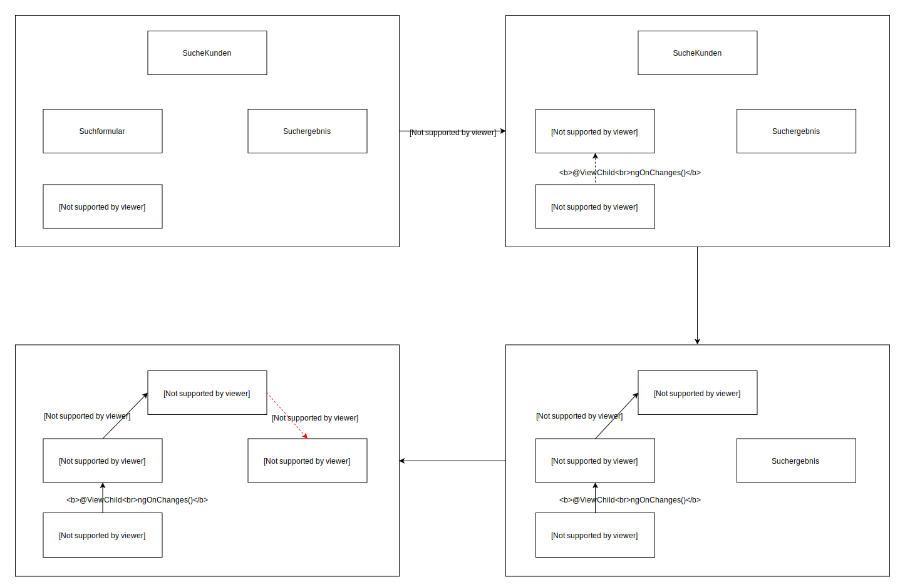

= Entwicklerhandbuch
:doctype: book
:icons: font
:plantuml-server-url: http://www.plantuml.com/plantuml

== Zustandsdiagramm

//Durch Bestätigen des Such-Buttons werden gefundene Kunden zur den ausgewählten Suchkriterien angezeigt.

---

---